# uribarri.online 

[](https://nodejs.org/)
[](https://reactjs.org/)
[](https://www.mysql.com/)
[](https://www.docker.com/)


## Descripción del Proyecto

uribarri.online es una plataforma de gestión de comercios online, agenda cultural y revista comunitaria diseñada específicamente para la gestión local del distrito02 de Bilbao: Uribarri. Esta solución permite a los establecimientos y agentes culturales de la zona ofrecer sus servicios y actividades culturales en formato digital de forma eficiente y accesible.

## Capturas de Pantalla

### Interfaz de usuario responsive

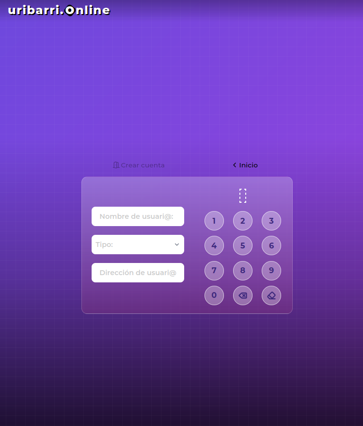

### Panel de administración y autenticación de usuarios
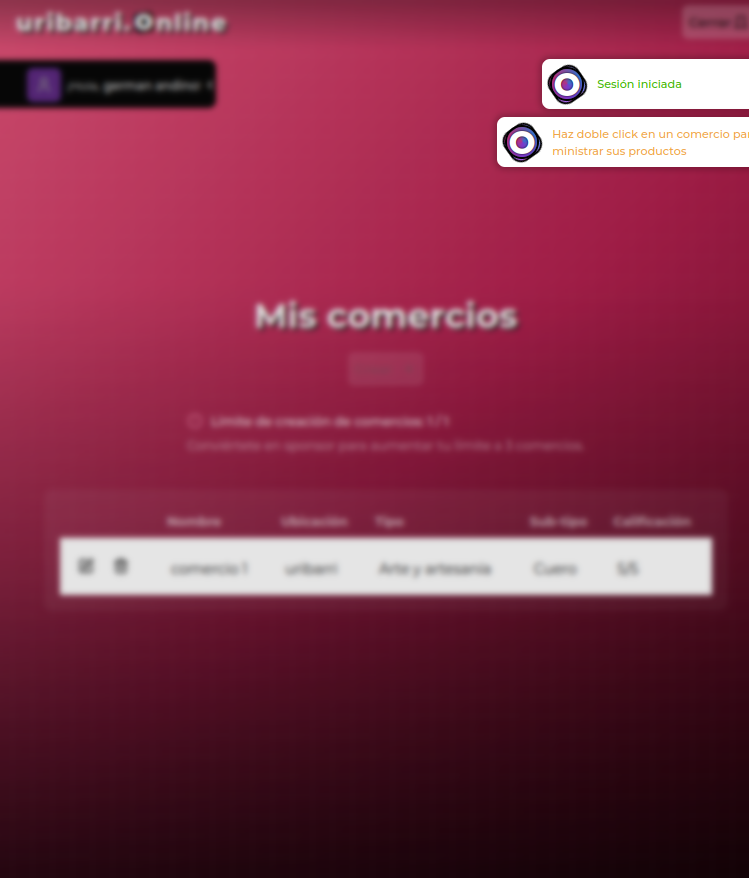
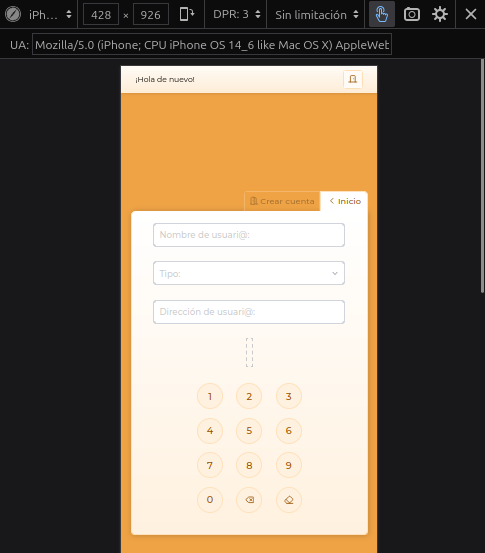
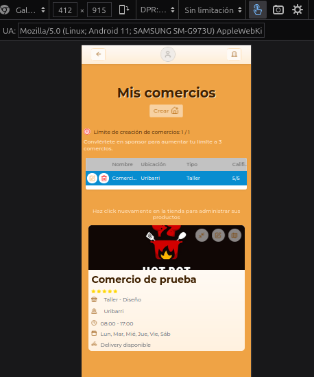
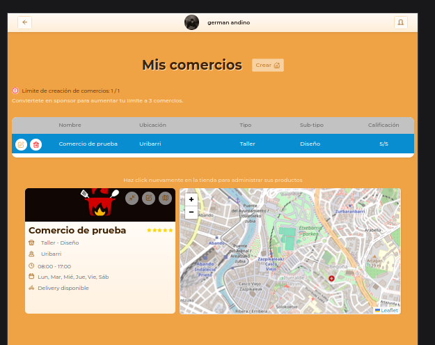
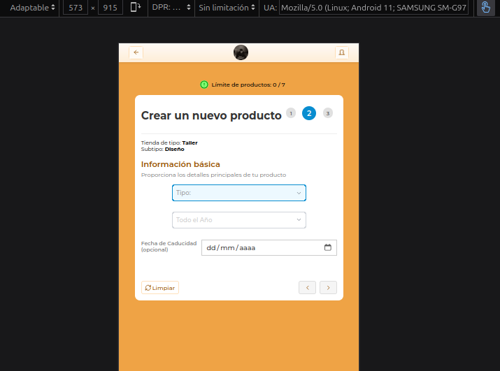
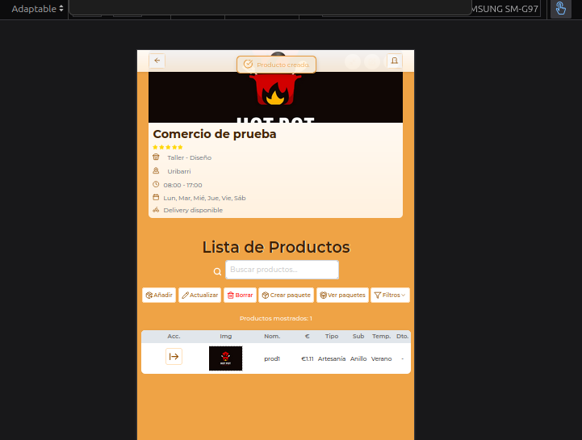

### Paneles de administración de comercios y productos
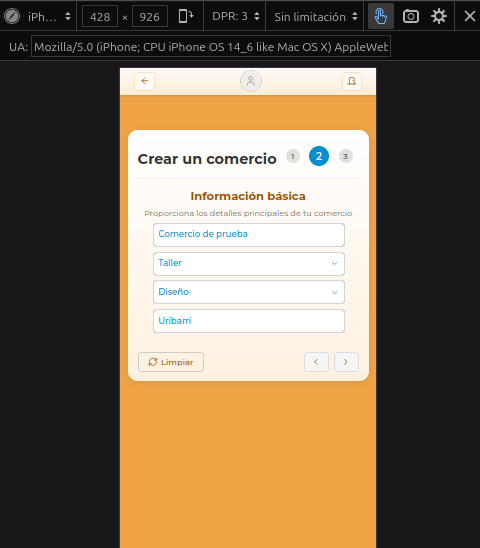
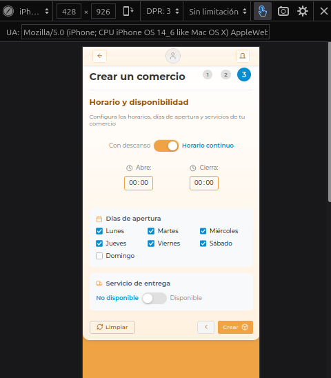
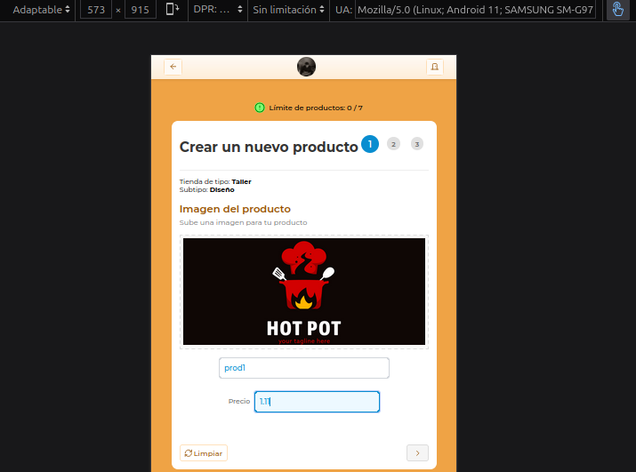
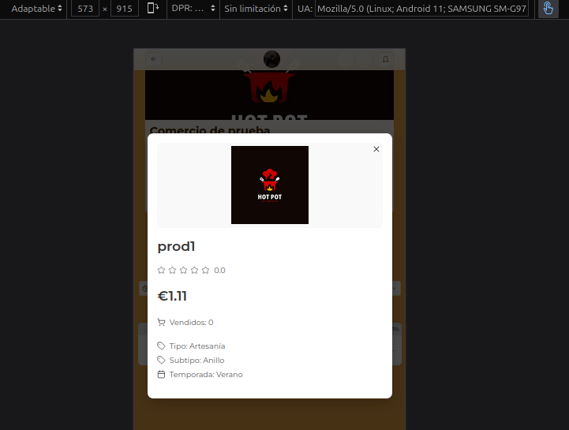
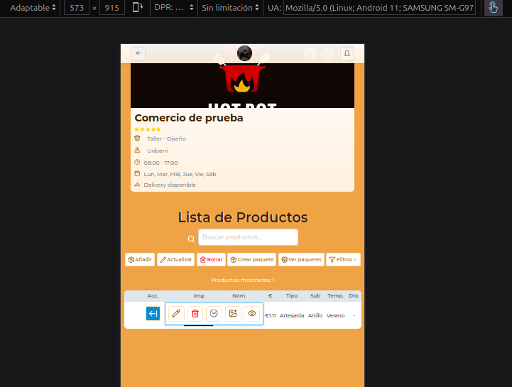
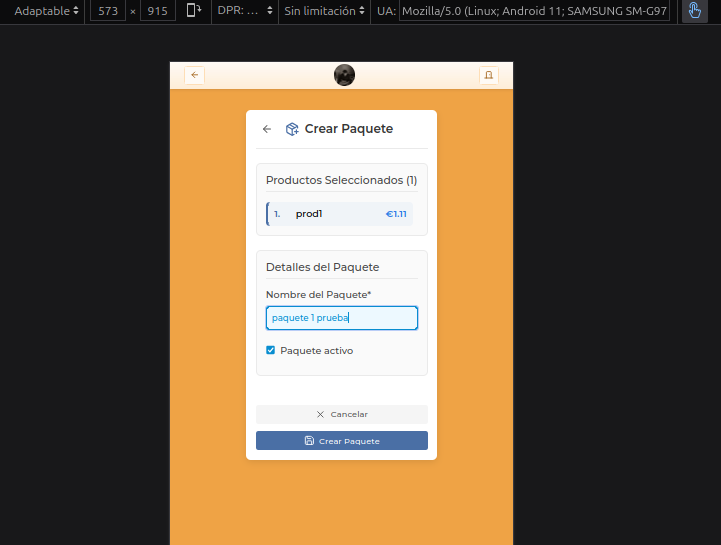

## Stack Tecnológico

### Frontend
- **React 18.3.1**: Biblioteca principal de UI
- **React Router DOM 7.0.1**: Navegación y enrutamiento
- **Axios 1.7.7**: Cliente HTTP para peticiones API
- **@react-spring/web 9.7.5**: Biblioteca de animaciones para transiciones fluidas
- **Leaflet 1.9.4 & React-Leaflet 5.0.0-rc.2**: Mapas interactivos para ubicaciones de tiendas
- **Lucide-React 0.456.0**: Componentes de iconos
- **CSS Modules**: Enfoque de estilizado para aislamiento de componentes

### Backend
- **Express 4.21.2**: Framework web para Node.js
- **Sequelize 6.37.5**: ORM para operaciones con base de datos
- **MySQL2 3.11.4**: Driver de base de datos
- **Bcrypt 5.1.0**: Encriptación de contraseñas
- **Dotenv 16.4.5**: Configuración de variables de entorno
- **Multer 1.4.5-lts.1**: Gestión de subida de archivos
- **Sharp 0.33.5**: Procesamiento y optimización de imágenes
- **Validate-image-type 3.0.0**: Validación de imágenes
- **CORS 2.8.5**: Compartición de recursos entre diferentes orígenes

## Arquitectura

El proyecto sigue una arquitectura Modelo-Controlador-Vista con un enfoque de diseño responsive mobile-first.

### Arquitectura Frontend

El frontend está construido usando React con un enfoque de gestión de estado basado en contextos:

```
App
├── /front-end    
    ├── /app_context            # Gestión del estado de la aplicación
        ├── AppContext.js       # Contexto principal
        ├── AuthContext.jsx     # Estado de autenticación
        ├── PackageContext.jsx  # Gestión de datos de paquetes
        ├── ProductContext.jsx  # Gestión de datos de productos
        ├── ShopContext.jsx     # Gestión de datos de tiendas
        └── UIContext.jsx       # Gestión del estado de la UI
    ├── /components             # Componentes reutilizables
        ├── CustomNumberInput.jsx
        ├── FiltersForProducts.jsx
        ├── /navigation_components
        ├── LoginRegisterForm   # Autenticación de usuarios
        ├── TopBar.jsx          # Navegación de la app
        └── ImageModal.jsx      # Visor de medios
```

### Arquitectura Backend

El backend sigue un patrón MVC estándar con Express.js y Sequelize ORM:

```
/back-end
├── index.js                    # Punto de entrada de la aplicación
├── /config                     # Archivos de configuración
├── /controllers                # Manejadores de lógica de negocio
    ├── /package
    ├── /product
    ├── /provider
    ├── /shop
    └── /user
├── /middleware                 # Procesamiento de peticiones
├── /models                     # Modelos de base de datos
├── /routers                    # Definiciones de rutas API
└── /utils                      # Funciones de utilidad
```

## Características Principales(e-commerce y agenda cultural)

- **Autenticación de Usuarios**: Sistema seguro de inicio de sesión y registro
- **Gestión de Tiendas**: Creación y administración de tiendas virtuales
- **Gestión de Productos**: Añadir, editar y organizar productos
- **Creación de Paquetes**: Agrupar productos en paquetes
- **Diseño Responsive**: Enfoque mobile-first con layouts adaptables
- **Subida de Imágenes**: Soporte para imágenes de productos y tiendas
- **Mapeo de Ubicaciones**: Representación geográfica de tiendas
- **Formularios Multi-etapa**: Interfaces paso a paso para entrada de datos complejos

## Requisitos de Desarrollo

### Prerrequisitos
- Node.js (versión recomendada: 16.x o superior)
- Base de datos MySQL
- Configuración de variables de entorno para conexión a base de datos y autenticación

## Directrices de Desarrollo

- Mantener el patrón de arquitectura existente al añadir nuevas funcionalidades
- Seguir el estilo de indentación de doble tabulación
- Usar módulos CSS para el estilizado y mantener el aislamiento de componentes
- Implementar nuevas modificaciones con comentarios apropiados
- Respetar el enfoque de diseño mobile-first

### Herramientas de Desarrollo
- **ESLint**: Herramienta de análisis de código estático
- **Nodemon**: Utilidad que monitoriza cambios en el código y reinicia automáticamente el servidor
- **Jest**: Framework de pruebas


## Autor

Desarrollado por German Andino

---

