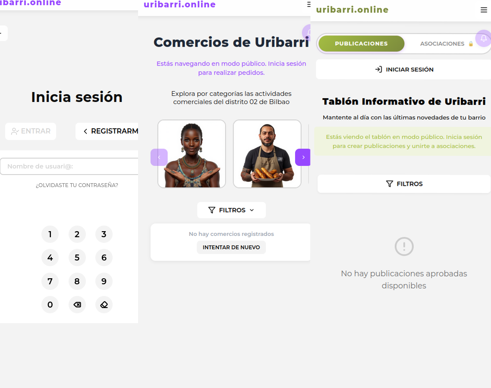
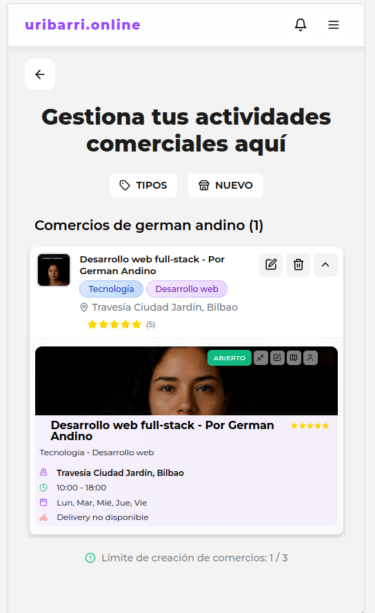
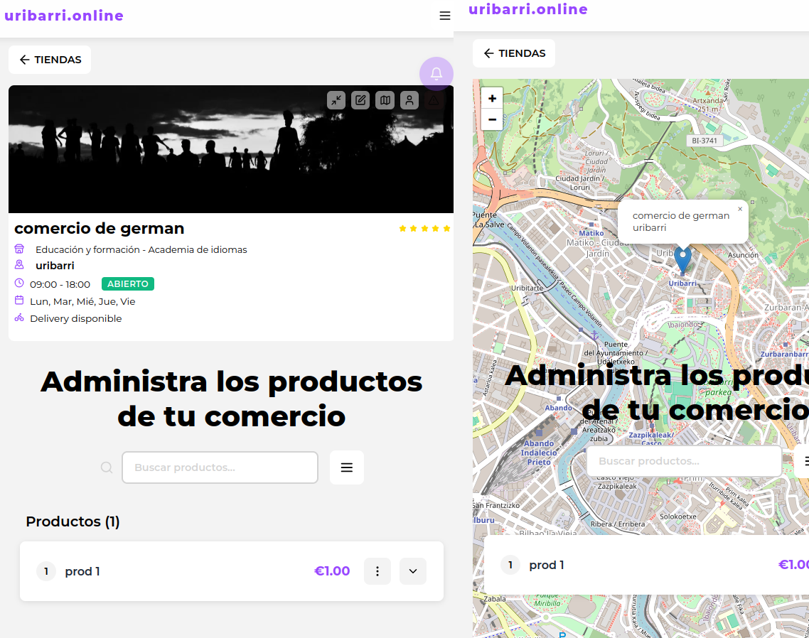

# uribarri.online

[](https://nodejs.org/)
[](https://reactjs.org/)
[](https://www.mysql.com/)
[](https://www.docker.com/)
[](https://expressjs.com/)
[](https://vitejs.dev/)


## Descripción del Proyecto (desarrollo en curso)

**uribarri.online** es un proyecto en desarrollo que a mediano plazo pretende ser de código abierto. Se trata de una plataforma integral de gestión de comercios online, agenda cultural y revista comunitaria diseñada específicamente para la gestión local del distrito 02 de Bilbao: Uribarri.

Esta solución permite a los establecimientos locales, agentes culturales y la comunidad del barrio ofrecer sus servicios, productos y actividades en formato digital de forma eficiente, accesible y colaborativa. La plataforma combina funcionalidades de e-commerce con características de red social comunitaria, fomentando la economía local y el tejido social del distrito.

## Capturas de Pantalla(diseño en progreso ;)

### Interfaz de usuario responsive




### Panel de administración y autenticación de usuarios



### Paneles de administración de comercios y productos


## Stack Tecnológico

### Frontend
- **React 18.3.1**: Biblioteca principal de UI
- **Vite 6.2.1**: Herramienta de construcción y desarrollo rápido
- **React Router DOM 7.0.1**: Navegación y enrutamiento
- **Axios 1.7.7**: Cliente HTTP para peticiones API
- **@react-spring/web 9.7.5**: Biblioteca de animaciones para transiciones fluidas
- **Leaflet 1.9.4 & React-Leaflet 5.0.0-rc.2**: Mapas interactivos para ubicaciones de tiendas
- **Lucide-React 0.456.0**: Componentes de iconos modernos
- **CSS Modules**: Enfoque de estilizado para aislamiento y organización de componentes

### Backend
- **Node.js 22.9.0**: Entorno de ejecución de JavaScript
- **Express 4.21.2**: Framework web minimalista para Node.js
- **Sequelize 6.37.5**: ORM robusto para operaciones con base de datos
- **MySQL2 3.11.4**: Driver MySQL de alto rendimiento
- **Bcrypt 5.1.0**: Encriptación segura de contraseñas
- **Nodemailer 6.9.7**: Servicio de envío de correos electrónicos
- **Multer 1.4.5-lts.1**: Middleware para gestión de subida de archivos
- **Sharp 0.33.5**: Procesamiento y optimización de imágenes de alto rendimiento
- **Validate-image-type 3.0.0**: Validación de tipos de imágenes
- **CORS 2.8.5**: Gestión de compartición de recursos entre diferentes orígenes
- **Dotenv 16.4.5**: Gestión de variables de entorno

### Base de Datos
- **MySQL 8.0**: Sistema de gestión de base de datos relacional
- **28 Modelos Sequelize**: Estructura de datos completa y normalizada
- **Relaciones complejas**: Foreign keys, índices y constraints para integridad de datos

### DevOps
- **Docker**: Containerización de aplicaciones
- **Docker Compose**: Orquestación de servicios (Backend + MySQL)
- **Gestión de volúmenes**: Persistencia de datos e imágenes

## Arquitectura

El proyecto sigue una arquitectura Modelo-Controlador-Vista con un enfoque de diseño responsive mobile-first.

### Arquitectura Frontend

El frontend está construido usando React con un enfoque de gestión de estado basado en contextos (Context API):

```
/front-end
├── /app_context                    # Gestión del estado de la aplicación
│   ├── AuthContext.jsx             # Autenticación y sesión de usuario
│   ├── UIContext.jsx               # Estado de la interfaz de usuario
│   ├── ShopContext.jsx             # Gestión de tiendas
│   ├── ProductContext.jsx          # Gestión de productos
│   ├── PackageContext.jsx          # Gestión de paquetes/ofertas
│   ├── OrderContext.jsx            # Gestión de pedidos
│   ├── OrganizationContext.jsx     # Gestión de organizaciones comunitarias
│   ├── PublicationContext.jsx      # Gestión de publicaciones
│   └── ParticipantContext.jsx      # Gestión de participantes
│
├── /components                     # Componentes organizados por funcionalidad (19+ grupos)
│   ├── /login_register             # Sistema de autenticación
│   ├── /top_bar                    # Barra de navegación principal
│   ├── /landing_page               # Página de inicio
│   ├── /shop_window                # Escaparate de tiendas
│   ├── /shop_store                 # Tienda individual
│   ├── /shop_management            # Gestión de tiendas (vendedores)
│   ├── /product_management         # Gestión de productos
│   ├── /info_management            # Tablón comunitario
│   ├── /user_management            # Gestión de perfil de usuario
│   ├── /rider_order_management     # Gestión de entregas
│   ├── /user_info_card             # Tarjeta de información de usuario
│   ├── /card_display               # Sistema de notificaciones
│   ├── /email_verification         # Verificación de email y recuperación de contraseña
│   └── ...                         # Más componentes especializados
│
├── /utils                          # Funciones utilitarias
│   ├── /animation                  # Transiciones y animaciones
│   ├── /app                        # Configuración de la app
│   ├── /image                      # Procesamiento de imágenes
│   └── /user                       # Validaciones de usuario
│
└── /css                            # Módulos CSS (~70 archivos)
```

### Arquitectura Backend

El backend sigue un patrón MVC (Modelo-Vista-Controlador) con separación de responsabilidades:

```
/back-end
├── index.js                        # Punto de entrada del servidor Express
│
├── /config                         # Configuración de la aplicación
│   └── sequelize.js                # Configuración de ORM y base de datos
│
├── /models                         # Modelos de datos (28 modelos Sequelize)
│   ├── user_model.js               # Usuarios del sistema
│   ├── shop_model.js               # Tiendas locales
│   ├── product_model.js            # Productos
│   ├── package_model.js            # Paquetes/ofertas
│   ├── order_model.js              # Pedidos
│   ├── organization_model.js       # Organizaciones comunitarias
│   ├── publication_model.js        # Publicaciones del tablón
│   ├── participant_model.js        # Participantes de organizaciones
│   ├── ip_registry_model.js        # Control de registros por IP
│   └── ...                         # Más modelos (tipos, categorías, valoraciones, etc.)
│
├── /controllers                    # Lógica de negocio (25+ controladores)
│   ├── /user                       # Controladores de usuarios
│   ├── /shop                       # Controladores de tiendas
│   ├── /product                    # Controladores de productos
│   ├── /package                    # Controladores de paquetes
│   ├── /order                      # Controladores de pedidos
│   ├── /organization               # Controladores de organizaciones
│   ├── /publication                # Controladores de publicaciones
│   └── ...                         # Más controladores
│
├── /routers                        # Definiciones de rutas API (26+ routers)
│   ├── api_router.js               # Router principal
│   ├── user_api_router.js          # Rutas de usuarios
│   ├── shop_api_router.js          # Rutas de tiendas
│   └── ...                         # Más routers
│
├── /middleware                     # Middleware de procesamiento
│   ├── ProfileUploadMiddleware.js  # Subida de imágenes de perfil
│   ├── ShopUploadMiddleware.js     # Subida de imágenes de tiendas
│   ├── ProductUploadMiddleware.js  # Subida de imágenes de productos
│   └── ...                         # Más middleware
│
├── /services                       # Servicios especializados
│   └── emailService.js             # Servicio de envío de emails
│
├── /utils                          # Funciones utilitarias
│   ├── imageConversionUtils.js     # Conversión de formatos de imagen
│   └── imageValidationUtilities.js # Validación de imágenes
│
└── /assets                         # Archivos estáticos
    └── /images                     # Almacenamiento de imágenes subidas
        ├── /users                  # Imágenes de perfiles
        └── /shops                  # Imágenes de tiendas y productos
```

## Características Principales

### Sistema de Autenticación y Usuarios
- **Registro de Usuarios Multi-rol**: Sistema de registro con 5 tipos de usuario (usuario, vendedor, repartidor, gestor de tienda, mayorista)
- **Verificación por Email**: Sistema de verificación de cuentas mediante correo electrónico con Nodemailer
- **Recuperación de Contraseña**: Funcionalidad completa de restablecimiento de contraseña
- **Control de Sesiones**: Gestión de sesiones con expiración automática (9 días)
- **Sistema de Roles y Permisos**: Permisos diferenciados según tipo de usuario
- **Perfil de Usuario**: Gestión completa de datos de perfil con subida de imágenes
- **Cambio de Contraseña**: Funcionalidad de cambio seguro de contraseña para usuarios autenticados
- **Sistema de Contribuidores**: Distintivos para contribuidores de la plataforma
- **Gestión de Organizaciones**: Capacidad para crear y administrar asociaciones comunitarias

### E-commerce y Gestión de Tiendas
- **Escaparate de Tiendas**: Visualización de tiendas locales con mapeo geográfico interactivo
- **Gestión de Tiendas**: Creación y administración completa de tiendas virtuales por vendedores
- **Gestión de Productos**: Sistema CRUD completo para productos con categorización
- **Creación de Paquetes**: Agrupación de productos en ofertas y paquetes especiales
- **Sistema de Pedidos**: Gestión de pedidos con seguimiento de estado
- **Gestión de Entregas**: Panel para repartidores con administración de órdenes
- **Subida de Imágenes Multi-formato**: Procesamiento y optimización automática con Sharp
- **Validación de Imágenes**: Validación de tipos y tamaños de archivos
- **Categorización Multi-nivel**: Sistema de categorías y tipos de productos

### Comunidad y Contenido
- **Tablón Comunitario**: Sistema de publicaciones para la comunidad del barrio
- **Organizaciones Locales**: Directorio y gestión de asociaciones y organizaciones
- **Sistema de Participantes**: Gestión de miembros de organizaciones
- **Agenda Cultural**: Publicación y gestión de eventos y actividades locales

### Características Técnicas
- **Diseño Responsive**: Enfoque mobile-first con breakpoints optimizados (320px, 360px, 481px, 641px, 1025px, 1440px)
- **Mapeo de Ubicaciones**: Integración con Leaflet para ubicaciones geográficas de tiendas
- **Animaciones Fluidas**: Transiciones suaves con React Spring
- **Sistema de Notificaciones**: CardDisplay con historial de notificaciones
- **Formularios Multi-etapa**: Interfaces paso a paso para entrada de datos complejos
- **Control de Registros por IP**: Sistema de prevención de spam y registros masivos
- **Sistema de Calificaciones**: Valoraciones de usuarios, productos y tiendas
- **Internacionalización**: Contenido en español optimizado para el distrito de Uribarri
- **Optimización de Imágenes**: Conversión automática a formatos optimizados
- **Validación de Datos**: Validación exhaustiva en frontend y backend

## Requisitos de Desarrollo

### Prerrequisitos
- **Node.js 22.9.0** (o superior)
- **MySQL 8.0** (o compatible)
- **Docker y Docker Compose** (opcional, para desarrollo containerizado)
- **NPM o Yarn** para gestión de paquetes

### Configuración de Variables de Entorno

El proyecto requiere variables de entorno para:
- Conexión a base de datos MySQL
- Configuración de servidor SMTP para envío de emails
- Claves de autenticación y seguridad
- Puerto del servidor backend

Crear archivos `.env` en las carpetas `back-end` y `front-end` con las variables necesarias.

## Directrices de Desarrollo

- Mantener el patrón de arquitectura existente al añadir nuevas funcionalidades
- Seguir el estilo de indentación de doble tabulación
- Usar módulos CSS para el estilizado y mantener el aislamiento de componentes
- Implementar nuevas modificaciones con comentarios apropiados
- Respetar el enfoque de diseño mobile-first

### Herramientas de Desarrollo
- **ESLint**: Herramienta de análisis de código estático
- **Nodemon**: Utilidad que monitoriza cambios en el código y reinicia automáticamente el servidor
- **Jest**: Framework de pruebas


## Autor

Desarrollado por German Andino

---

